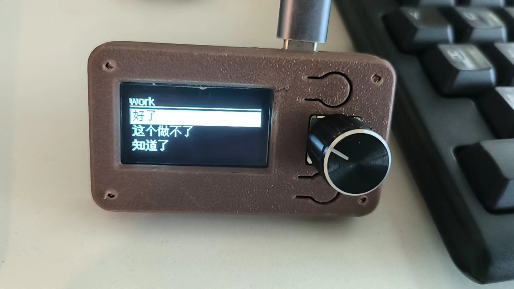

# Type it — Macro Keyboard



A pocket macro keyboard for the snippets you type over and over: chat replies,
work responses, template text. Turn the knob, pick a snippet, and it is sent —
as real USB HID keystrokes on the hardware, or straight to your clipboard in
the desktop demos.

Three interchangeable front-ends share one data model: a **profile** is a
`.txt` file whose non-empty lines are **candidates**, and everything re-sorts
by **most-recently-used**.

| Component | What it is | Docs |
|-----------|------------|------|
| [`hardware/`](hardware/) | RP2040 Zero firmware + enclosure, types over USB HID | [hardware/README.md](hardware/README.md) |
| [`software/golang/`](software/golang/) | Go/Ebiten desktop demo → clipboard | [software/golang/README.md](software/golang/README.md) |
| [`software/python/`](software/python/) | pygame desktop demo → clipboard | [software/python/README.md](software/python/README.md) |

## Quick start

- **Hardware** — wire per [`hardware/WIRING.md`](hardware/WIRING.md), install
  the toolchain per [`hardware/DEPENDENCIES.md`](hardware/DEPENDENCIES.md),
  upload [`hardware/type_it/`](hardware/type_it/).
- **Go demo** — `cd software/golang && ./compile.sh && ./type_it`
- **Python demo** — `cd software/python && pip install -r requirements.txt && python main.py`

## Shared interaction model

- Turn the knob (or scroll) to move the highlight.
- Short-press to open a profile / type or copy a candidate.
- Long-press to go back.

## Repository layout

```text
.
├── hardware/              # RP2040 firmware, wiring, enclosure
│   ├── type_it/           # Arduino sketch
│   ├── casing/            # 3D-printable enclosure
│   ├── WIRING.md
│   └── DEPENDENCIES.md
├── software/
│   ├── golang/            # Ebiten desktop demo
│   └── python/            # pygame desktop demo
└── README.md
```

## License

Released into the public domain under the [Unlicense](https://unlicense.org).
See [`LICENSE`](LICENSE).

