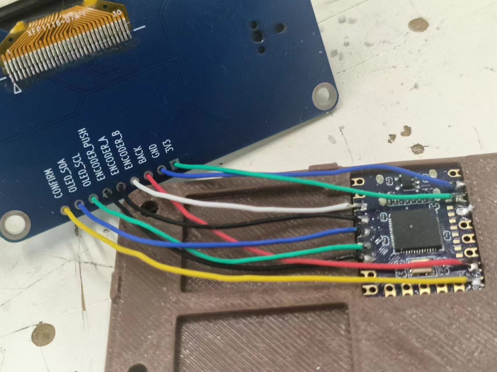

# Wiring Guide — type_it Macro Keyboard

This document describes how to connect the RP2040 Zero to the SH1106 I2C display + rotary encoder module described in `pinouts.txt`.

## Parts

- **MCU**: Waveshare RP2040 Zero (or any RP2040 board with the same GPIO labels)
- **Display / input module**: 1.3" SH1106 128×64 I2C OLED + EC11 rotary encoder + CON/BAK buttons
  - Connector labels from `pinouts.txt`: `CON, SDA, SCL, PSH, TRA, TRB, BAK, GND, VCC`
- **Breadboard and jumper wires** (or a custom PCB)

## Default GPIO mapping

The firmware uses the following RP2040 Zero GPIO pins by default. They are grouped together so you can use one side of the board for the whole module.

| Module pin | Function          | RP2040 Zero GPIO | Note |
|------------|-------------------|------------------|------|
| VCC        | 3.3 V power       | 3V3              | Do **not** connect to 5 V |
| GND        | Ground            | GND              | |
| SDA        | I2C data          | GP4              | `PIN_SDA` in `type_it.ino` |
| SCL        | I2C clock         | GP5              | `PIN_SCL` in `type_it.ino` |
| TRA        | Encoder A phase   | GP3              | `PIN_ENC_A` in `type_it.ino` |
| TRB        | Encoder B phase   | GP2              | `PIN_ENC_B` in `type_it.ino` |
| PSH        | Encoder push switch | GP6            | `PIN_ENC_SW` in `type_it.ino` |
| CON        | Confirm button    | GP14              | `PIN_CON` in `type_it.ino` **(optional)** |
| BAK        | Back button       | GP15             | `PIN_BAK` in `type_it.ino` **(optional)** |

> The exact GPIO numbers are arbitrary — any digital GPIO can be used for the buttons and encoder, and any I2C-capable GPIO pair can be used for SDA/SCL. If you change the wiring, update the `#define PIN_...` lines at the top of `type_it/type_it.ino`.

## Minimal wiring (encoder push switch only)

If you only want the rotary encoder's built-in push switch and do not wire the separate `CON`/`BAK` buttons, change the top of `type_it.ino` to:

```cpp
#define PIN_CON   -1
#define PIN_BAK   -1
```

With this setup the encoder switch does everything:

| Action | How |
|--------|-----|
| Confirm / open profile / type candidate | Short press the encoder knob |
| Go back | Long-press the encoder knob (> 600 ms) |

## Wiring tutorial

<!-- a picture showing actual wiring -->



Thin wires stripped from common data cabling are sufficient.

Step-by-step guide:

- Strip and pre-solder the wire coils before inserting them into the RP2040 solder holes.
- Optionally, use tape or heavy objects, or combine tape with thin plates, to hold the coils in place before soldering.
- Solder the coils onto the RP2040 board.
- Insert the coils into the corresponding holes on the display board.
- Pull the coils taut so the display board can be pushed down into place, close enough for the enclosure to be assembled.
- Use tape to hold the display in place.
- Cut off excess wire length, leaving at most 1 cm per wire.
- Use a soldering iron to heat the insulation of each wire and strip it off manually.
- Solder each wire into its corresponding hole on the display board.
- Trim any excess coil length.
- Remove the tape and assemble the enclosure.

## Pull-ups

- The firmware configures `INPUT_PULLUP` for all button and encoder pins. No external pull-up resistors are required for the switches or encoder A/B pins.
- The SH1106 module usually includes its own I2C pull-up resistors. If your module does not, add 4.7 kΩ pull-ups from SDA and SCL to 3.3 V.

## Encoder direction

If turning the knob clockwise moves the highlight **up** instead of **down**, swap the `PIN_ENC_A` and `PIN_ENC_B` definitions (or physically swap the `TRA` and `TRB` wires).

## I2C address

The default SH1106 I2C address is `0x3C`. If the display stays black after upload:

1. Check the module documentation for the correct address (some modules use `0x3D`).
2. If you need `0x3D`, change the U8g2 constructor in `type_it.ino` from:
   ```cpp
   U8G2_SH1106_128X64_NONAME_F_HW_I2C u8g2(U8G2_R0, U8G2_PIN_NONE);
   ```
   to:
   ```cpp
   U8G2_SH1106_128X64_NONAME_F_HW_I2C u8g2(U8G2_R0, U8G2_PIN_NONE, /* SCL */ PIN_SCL, /* SDA */ PIN_SDA, /* reset */ U8G2_PIN_NONE);
   u8g2.setI2CAddress(0x3D * 2);
   ```

## Physical layout tips

- Keep the I2C wires (SDA/SCL) short and twisted if possible to reduce noise.
- The encoder A/B wires can pick up noise; if you see erratic scrolling, add 100 nF ceramic capacitors from each encoder pin to GND, or reduce the wire length.
- The RP2040 Zero is 3.3 V only. Do not connect 5 V logic signals to the GPIO pins.

## Next steps

After wiring, follow `DEPENDENCIES.md` to install the required Arduino libraries and upload the firmware.
